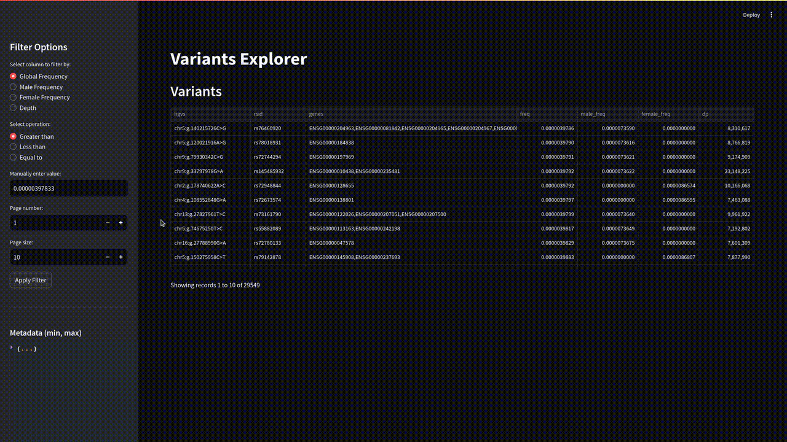

# Dasa Variant Call Explorer Challenge



Code for the dasa Variant Call Format (VCF) challenge. It includes code for:
 - Annotating a VCF file;
 - Serving the annotated file via a rest API;
 - Frontend display for the API.

The code is structured using a microservice architecture, with one container for data processing and API, and another one for the frontend.

## Installation

### Docker (Recommended)

#### 1. Clone the repository

```bash
git clone https://github.com/matheusfvesco/dasa-vcf-challenge.git
```

#### 2. Build the image

Use the following command to build the image:
```bash
docker compose up -d
```

See usage section for more details

### Local install for development

#### 1. Clone the repository

```bash
git clone https://github.com/matheusfvesco/dasa-vcf-challenge.git
```

#### 2. Install dependencies

Run the following commands in your terminal:
```bash
uv sync --package api
```

```bash
uv sync --package frontend
```

If datrie build fails, try to use `export AR=/usr/bin/ar` and running the steps above again. For more information, [see](https://github.com/astral-sh/uv/issues/7525#issuecomment-2373126442).

#### 3. Run files

Use `uv run --package <name>` to run scripts. For example:

1. To run API:
```bash
uv run --package api fastapi run serve.py --port 4000
```

2. To run frontend:

```bash
uv run --package frontend streamlit run frontend.py --server.fileWatcherType none
```

## Tests

To run tests, use pytest. Use the following command:
```bash
uv run --package api pytest
```

## Usage

The web interface will be accessible at [http://localhost:8501/](http://localhost:8501/). After running the container for the first time, the file will be processed. This will take some time. The web interface will update when the file is finishes the processing step.

After the file is processed, you may access the api at [http://localhost:4000](http://localhost:4000). Use [http://localhost:4000/docs](http://localhost:4000/docs) to further explore how to use the API.